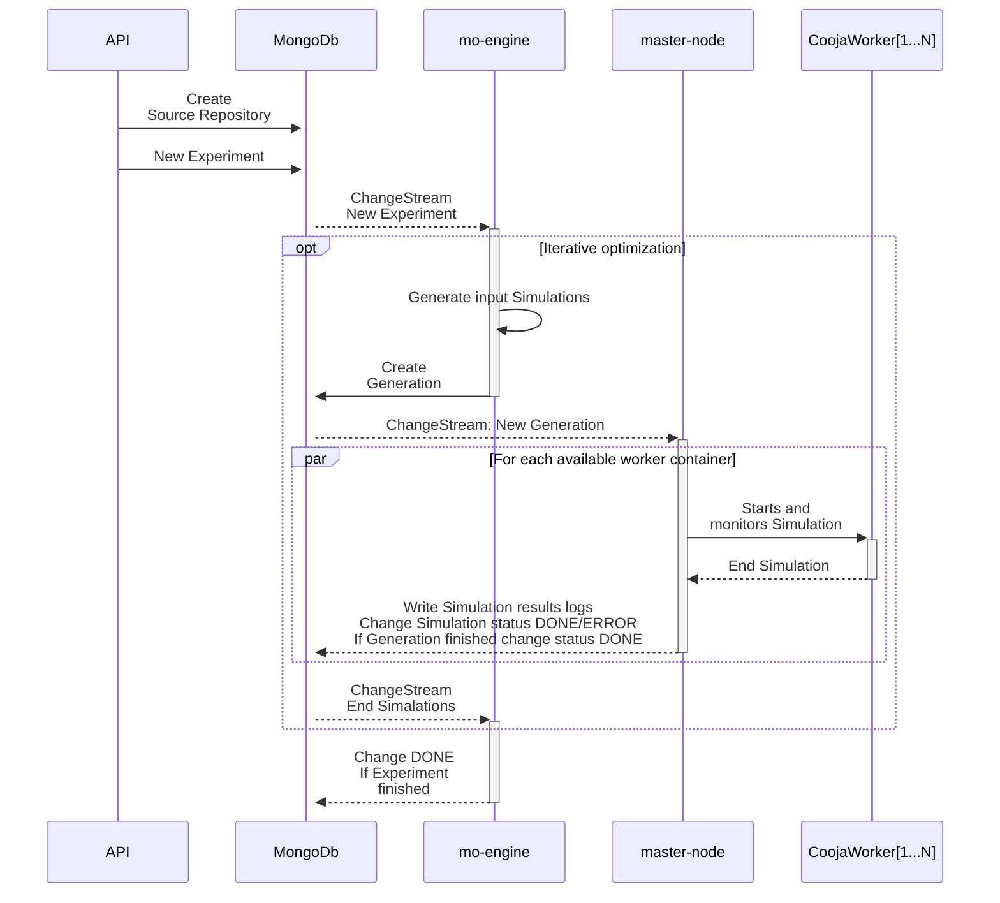

# simlab
 This repository hosts a scalable multi-objective optimization simulation system for sensor networks, built on Cooja and Docker. It enables the distributed execution of evolutionary algorithms within a containerized environment, while efficiently managing experiment workflows through Docker orchestration and MongoDB integration.

 ---

## System Architecture
The system is composed of five main components:

1. **API**
   - Provides a RESTful interface for creating and managing experiments.
   - Full CRUD operations for **source repositories**, **experiments**, **generations** and **simulations** in MongoDB.
   - Enables uploading source/configuration files to be used in simulations (source repositories).
   - Supports downloading of logs and output files stored in MongoDB/GridFS.
   - Ensures compatibility with external clients.

2. **Database (MongoDB + GridFS)**
   - Central data lake for storing experiments, generations, and simulation metadata.
   - Uses GridFS to manage large files (e.g., logs, Cooja `.csc` configs, `.dat` position files).
   - Provides Change Streams to trigger workflows when new experiments or results are available.

3. **mo-engine**
   - Runs evolutionary algorithms (e.g., NSGA-II/III, MOEA/D, EDA, MCTS).
   - Generates new candidate solutions and enqueues simulations into MongoDB.
   - Implements strategies (random generation, iterative refinement, Pareto-based search).
   - Listens to MongoDB Change Streams for simulation results to decide the next steps (e.g., generating new generations or updating experiment status).

4. **master-node**
   - Observes the **generations** collection via Change Streams to build the simulation queue.
   - Dynamically manages the lifecycle of Docker containers for distributed simulations.
   - Transfers simulation input data to containers via **SCP**.
   - Monitors running simulations via **SSH**.
   - Collects logs and output files and registers results back into MongoDB/GridFS.
   - Ensures scalability by dispatching simulations across available workers.

5. **Cooja Simulation Containers**
   - Each container runs a dedicated Cooja instance for a single simulation task.
   - Receives experiment input files from the master-node.
   - Executes the Contiki-NG firmware under controlled conditions.
   - Generates logs and measurement data (latency, energy, RSSI, hops, packet loss, etc.).
   - Returns results to the master-node for persistence in MongoDB/GridFS.

## Features
- **Distributed Processing:** Parallel execution of multiple simulations.
- **Seamless Data Flow:** Integration with MongoDB for real-time result processing.
- **Automation:** End-to-end automated execution from algorithm evolution to result collection.

### System Topology

### SimLab Work Sequence

Below is a simplified diagram of the SimLab workflow:

### Core Data Model (Entity-Relationship)

---

## Installation
### Prerequisites
- Docker & Docker Compose
- Python (>= 3.12)
- MongoDB
- [Docker Image Cooja (Contiki-NG environment)](https://github.com/JunioCesarFerreira/Cooja-Docker-VM-Setup)

### Setup Instructions

*It is yet to be completed.*

## Usage

*It is yet to be completed.*

## Future Enhancements

*It is yet to be completed.*

## License
This project is licensed under the [MIT License](./LICENSE).

## Contributing
Contributions are welcome! Please submit issues or pull requests for improvements.