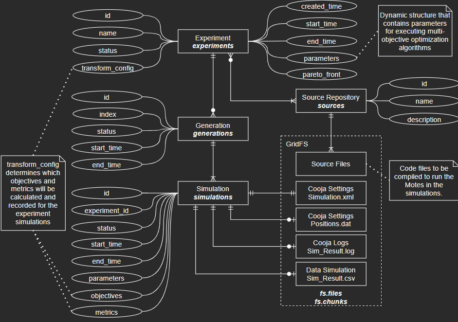

# simlab

🌍 *[**English**](README.md) ∙ [Português](README_pt.md)*

 This repository hosts a scalable multi-objective optimization simulation system for sensor networks, built on **Cooja/Contiki-NG**, **Docker** and **MongoDB/GridFS**.
 It orchestrates the end-to-end experiment lifecycle: solution generation (mo-engine), parallel simulation in containers (master-node), and reproducible result collection/storage—driven by MongoDB **Change Streams** and exposed through a **REST API** (Swagger UI).

 ---

## System Architecture
The system is composed of five main components:

1. **API**
   - Provides a RESTful interface for creating and managing experiments.
   - Full CRUD operations for **source repositories**, **experiments**, **generations** and **simulations** in MongoDB.
   - Enables uploading source/configuration files to be used in simulations (source repositories).
   - Supports downloading of logs and output files stored in MongoDB/GridFS.
   - Ensures compatibility with external clients.

2. **database (MongoDB + GridFS)**
   - Central data lake for storing experiments, generations, and simulation metadata.
   - Uses GridFS to manage large files (e.g., logs, Cooja `.csc` configs, `.dat` position files).
   - Provides Change Streams to trigger workflows when new experiments or results are available.

3. **mo-engine**
   - Runs evolutionary algorithms (e.g., NSGA-II/III, MOEA/D, EDA, MCTS).
   - Generates new candidate solutions and enqueues simulations into MongoDB.
   - Implements strategies (random generation, iterative refinement, Pareto-based search).
   - Listens to MongoDB Change Streams for simulation results to decide the next steps (e.g., generating new generations or updating experiment status).

4. **master-node**
   - Observes the **generations** collection via Change Streams to build the simulation queue.
   - Dynamically manages the lifecycle of Docker containers for distributed simulations.
   - Transfers simulation input data to containers via **SCP**.
   - Monitors running simulations via **SSH**.
   - Collects logs and output files and registers results back into MongoDB/GridFS.
   - Ensures scalability by dispatching simulations across available workers.

5. **Cooja Simulation Containers**
   - Each container runs a dedicated Cooja instance for a single simulation task.
   - Receives experiment input files from the master-node.
   - Executes the Contiki-NG firmware under controlled conditions.
   - Generates logs and measurement data (latency, energy, RSSI, hops, packet loss, etc.).
   - Returns results to the master-node for persistence in MongoDB/GridFS.

---

## Features
- **Distributed Processing:** Parallel execution of multiple simulations.
- **Seamless Data Flow:** Integration with MongoDB for real-time result processing.
- **Automation:** End-to-end automated execution from algorithm evolution to result collection.

---

### System Topology


### SimLab Work Sequence

Below is a simplified diagram of the SimLab workflow:


### Core Data Model (Entity-Relationship)



---

## Repository Organization

### Directories and Files

- `docs/`: supplementary documentation such as notes, images and diagrams.
- `master-node/`: Python code for the Master-Node orchestrator.
- `mo-engine/`: Python code for the evolutionary engine.
- `pylib/`: shared Python library used across components.
- `rest-api/`: Python REST API.
- `util/`: utility scripts for development, deployment and monitoring.
- `Dockerfiles`: Dockerfiles and `docker-compose` configurations to build and run the system.

---

## Installation
### Prerequisites
- Docker & Docker Compose
- Python (>= 3.12)
- MongoDB
- [Docker Image Cooja (Contiki-NG environment)](https://github.com/JunioCesarFerreira/Cooja-Docker-VM-Setup)

### Setup Instructions


Follow these steps to get SimLab up and running locally using Docker.

#### 1. Clone the repository

```bash
git clone https://github.com/JunioCesarFerreira/simlab.git
```

#### 2. Enter the project directory

```bash
cd simlab
```

#### 3. Adjust `docker-compose` settings

Open the `docker-compose.yaml` and configure the following parameters:

* **Ports**: make sure the host ports do not conflict with existing services on your machine (for e.g. REST API, MongoDB, etc.).
* **Number of Cooja simulators** (or simulation instances): edit the replicas or service definitions (for example, under `mo-engine` or `simulators`) to set how many Coojas you want to launch.
* (Optional) Adjust environment variables or volumes if needed (e.g. data directories, network settings).

Example snippets you may need to adjust:

```yaml
services:
  mo-engine:
    replicas: 3       # number of Cooja instances
    ports:
      - "5001:5001"
    environment:
      - COOJAS_PER_NODE=3
  rest-api:
    ports:
      - "8080:8080"
```

After editing, save the file.

#### 4. Launch the full stack with Docker Compose

Run:

```bash
docker-compose up --build -d
```

This command will build (if needed) and start all containers in detached mode.

If you want to see logs in real time, you can omit `-d`:

```bash
docker-compose up --build
```

#### 5. Verify that all containers are running as expected

Use:

```bash
docker-compose ps
```

You should see a list of containers with their state (e.g. `Up`) and mapped ports. Confirm that:

* The **rest_api** container is running and listening on the configured port (e.g. `8080`)
* The **mo_engine** container is running
* The **master_node** container is running
* Any auxiliary services (e.g. database, cooja's) are running

If any container is not up (e.g. `Exited`), inspect its logs:

```bash
docker-compose logs <service-name>
```

to debug the issue (missing dependency, port conflict, environment variable error, etc.).

Once all containers are running, your SimLab environment should be operational and ready to accept simulation experiment requests via the REST API.

---

## Usage

> This section will be updated soon as the GUI develops.

Once the environment is fully running (as described in the **Setup Instructions**), the system can be operated primarily through the **Swagger UI** exposed by the REST API.

### 1. Access the API Interface

Open your web browser and navigate to:

```
http://localhost:8000/docs
```

This launches the **Swagger UI**, which provides an interactive interface for all available REST endpoints.

### 2. Upload Source Files

Use the `POST /repositories` endpoint to create a **Source Repository** and upload the files required for your simulations.
These may include:

* Cooja `.csc` configuration files
* Contiki-NG firmware binaries (`.elf`, `.sky`, etc.)
* Node position or parameter files (`.dat`, `.json`)

Each uploaded repository becomes available for reference in subsequent experiments.

### 3. Create and Launch an Experiment

Use the `POST /experiments` endpoint to define a new **Experiment**, referencing the source repository created in the previous step.
Experiments specify:

* The optimization strategy (e.g., `random_generation`, `nsga3_iteration`)
* Objective functions and constraints
* Simulation parameters and limits

Once created, the **mo-engine** and **master-node** components automatically detect the new experiment through MongoDB Change Streams and begin distributed execution.

### 4. Monitor Simulations

You can monitor the progress of simulations using one or more of the following methods:

* **Swagger:** query the `/simulations`, `/generations`, and `/experiments` endpoints to check current states and metrics.
* **MongoDB Shell or Compass:** directly inspect documents in the `simlab` database.
* **Docker CLI:** use commands such as

  ```bash
  docker ps
  docker logs <container-name>
  docker exec -it <container-name> bash
  ```

  to monitor the `master-node`, `mo-engine`, or active Cooja simulation containers in real time.

### 5. Retrieve Results

When simulations complete, use the **Swagger UI** again to:

* Download simulation outputs and logs via the `/simulations/{id}/file/{field_name}` or `/files/{file_id}/as/{extension}` endpoints.
* Analyze results with external tools or scripts (e.g., Python notebooks, statistical analysis, or plotting utilities).

All raw outputs, logs, and metadata are stored in MongoDB/GridFS for reproducibility and traceability.


### Additional Resources

* **Synthetic Problems Guide**
  A detailed usage guide for running synthetic benchmark problems (without requiring Cooja) is available in the [documentation directory](./docs/markdown/SYNTHETIC_MODE.md).

* **Changelog**
  Recent updates and feature additions are documented in the [`CHANGELOG.md`](./CHANGELOG.md) file.

---

## Future Enhancements

- Complete documentation of setup and deployment workflows
- Additional testing and CI automation  
- Extended examples of experiment submission and monitoring  
- Benchmark dataset publication and performance validation  
- Development of a graphical user interface (GUI) in Vue.js to simplify experiment configuration, execution monitoring, and result visualization  
- English and Portuguese documentation parity  

---

## License
This project is licensed under the [MIT License](./LICENSE).

---

## Contributing

Contributions are welcome!  
SimLab is an open research and development project designed to support distributed multi-objective simulation workflows.  
If you want to contribute with code, documentation, bug reports, or experiments, please read the following guidelines.

### Repository structure

SimLab is composed of several main modules:

- **rest-api/** — FastAPI-based REST service for experiment and simulation management  
- **mo-engine/** — Multi-objective optimization engine (Python)  
- **master-node/** — Simulation orchestrator that manages Cooja containers via SSH/SCP  
- **pylib/** — Shared Python utilities (MongoDB, DTOs, statistics, etc.)  
- **debug/** — Lightweight Docker Compose environments for local testing and debugging  
- **docs/** — Documentation, Diagrams and Markdown guides (e.g., synthetic data, setup)  

When contributing, please make sure changes are consistent with this modular architecture.

### How to contribute

1. **Fork** the repository on GitHub

2. **Create a branch** for your feature or fix  
   ```bash
   git checkout -b feature/my-new-feature
   ```

3. **Implement your changes**
   * Follow the existing code style and structure
   * Add comments or docstrings where relevant
   * For new modules, include minimal working examples or usage notes

4. **Test locally** using one of the debug setups
   ```bash
   cd debug/simple
   docker-compose up --build
   ```
5. **Commit using clear messages**

   ```bash
   git commit -m "Add feature: synthetic benchmark support in master-node"
   ```
6. **Push your branch** and open a Pull Request (PR)

   * Describe the purpose of your changes
   * Include relevant logs, screenshots, or results if applicable
   * If fixing an issue, reference it (e.g., “Fixes #42”)

### Code quality and style

* **Python:** follow conventions
* **C/C++:** prefer clarity, small functions, and no external dependencies
* **Docker:** build images reproducibly; keep images small and self-contained
* Use consistent **logging** (as already done with `logging` in master-node)
* Always handle exceptions gracefully and mark MongoDB simulation states properly

### Testing and debugging

* Use the setups under `debug/` for local runs:

  ```bash
  cd debug/local
  docker-compose up --build
  ```
* Run synthetic mode for validation without Cooja:

  ```bash
  export ENABLE_DATA_SYNTHETIC=true
  docker-compose up master-node
  ```
* Make sure simulations complete and update states correctly in MongoDB.

### Pull request checklist

Before submitting a PR:

- [ ] Code compiles and runs locally
- [ ] No breaking changes introduced to API or DTOs
- [ ] All modified files follow the style conventions
- [ ] Documentation updated (README, Setup, or Usage as needed)
- [ ] Changelog entry added if relevant (`CHANGELOG.md`)
- [ ] Commit messages are clear and descriptive

### Reporting issues

If you find a bug or inconsistency:

1. Check if the issue already exists in the [Issues](https://github.com/JunioCesarFerreira/simlab/issues) tab.
2. If not, open a new issue and include:

   * Steps to reproduce
   * Expected vs. actual behavior
   * Relevant logs or stack traces
   * Environment details (OS, Docker version, etc.)

---

## Citing or referencing SimLab
>
>If you use SimLab in academic work, please cite the corresponding publication once available.
>Until then, you may reference the project as:
>
> Junio Cesar Ferreira.
> SimLab: A Distributed Simulation Framework for Multi-objective Optimization.
> Institute of Mathematical and Computer Sciences (ICMC), University of São Paulo (USP).
> GitHub: https://github.com/JunioCesarFerreira/simlab
