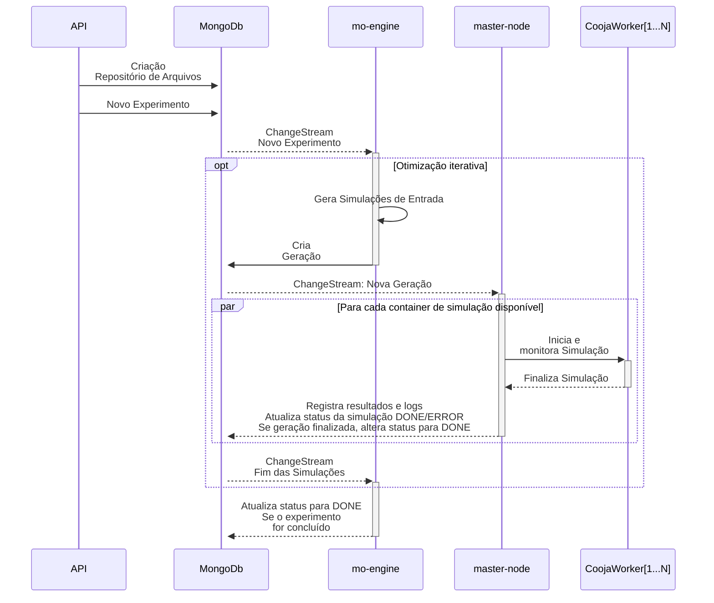

# simlab

🌍 *[**Português**](README_pt.md) ∙ [English](README.md)*

# simlab

Este repositório hospeda um sistema escalável de simulação e otimização multiobjetivo para redes de sensores, desenvolvido sobre **Cooja/Contiki-NG**, **Docker** e **MongoDB/GridFS**.
Ele orquestra, de ponta a ponta, o ciclo de experimentos: geração de soluções (mo-engine), execução paralela de simulações em containers (master-node) e coleta/armazenamento reprodutível de resultados, dirigidos por **Change Streams** do MongoDB e expostos via **API REST** (Swagger UI).

---

## Arquitetura do Sistema

O sistema é composto por cinco componentes principais:

1. **API**

   * Fornece uma interface RESTful para criação e gerenciamento de experimentos.
   * Implementa operações completas de CRUD para **repositórios de arquivos**, **experimentos**, **gerações** e **simulações** no MongoDB.
   * Permite o upload de arquivos-fonte e de configuração a serem usados nas simulações (repositórios de origem).
   * Suporta o download de logs e arquivos de saída armazenados no MongoDB/GridFS.
   * Garante compatibilidade com clientes externos.

2. **Banco de Dados (MongoDB + GridFS)**

   * Atua como o repositório central de dados, armazenando experimentos, gerações e metadados de simulação.
   * Utiliza o **GridFS** para gerenciar arquivos grandes (por exemplo: logs, configurações `.csc` do Cooja e arquivos `.dat` de posição).
   * Emprega **Change Streams** para acionar fluxos de trabalho automaticamente quando novos experimentos ou resultados são disponibilizados.

3. **mo-engine**

   * Executa algoritmos evolutivos (por exemplo, NSGA-II/III, MOEA/D, EDA, MCTS).
   * Gera novas soluções candidatas e as insere na fila de simulações no MongoDB.
   * Implementa estratégias de geração (aleatória, iterativa, baseada em Pareto, etc.).
   * Escuta *Change Streams* do MongoDB para detectar resultados de simulação e decidir os próximos passos (por exemplo, criar novas gerações ou atualizar o status do experimento).

4. **master-node**

   * Observa a coleção de **gerações** via *Change Streams* para construir a fila de simulações.
   * Gerencia dinamicamente o ciclo de vida dos containers Docker que executam as simulações distribuídas.
   * Transfere dados de entrada para os containers via **SCP**.
   * Monitora a execução das simulações via **SSH**.
   * Coleta logs e arquivos de saída, registrando os resultados no MongoDB/GridFS.
   * Garante escalabilidade despachando simulações entre múltiplos *workers* disponíveis.

5. **Containers de Simulação Cooja**

   * Cada container executa uma instância dedicada do **Cooja** para uma única simulação.
   * Recebe os arquivos de entrada do experimento enviados pelo *master-node*.
   * Executa o firmware do **Contiki-NG** sob condições controladas.
   * Gera logs e métricas de desempenho (latência, energia, RSSI, número de saltos, perda de pacotes, etc.).
   * Retorna os resultados ao *master-node* para armazenamento permanente no MongoDB/GridFS.

---

## Funcionalidades

* **Processamento Distribuído:** execução paralela de múltiplas simulações.
* **Fluxo de Dados Integrado:** integração total com o MongoDB para processamento em tempo real.
* **Automação Completa:** execução de ponta a ponta — da evolução do algoritmo à coleta dos resultados.

---

### Topologia do Sistema


### Sequência de Trabalho do SimLab

O diagrama abaixo ilustra o fluxo de trabalho simplificado do SimLab:



### Modelo de Dados Central (Entidade-Relacionamento)


---

## Organização do Repositório

### Diretórios e Arquivos

* `docs/`: documentação suplementar, incluindo notas, imagens e diagramas.
* `master-node/`: código Python do orquestrador de simulações.
* `mo-engine/`: código Python do motor evolutivo.
* `pylib/`: biblioteca Python compartilhada entre os componentes.
* `rest-api/`: serviço REST em Python (FastAPI).
* `util/`: scripts utilitários para desenvolvimento, implantação e monitoramento.
* `Dockerfiles/`: definições de imagens e configurações do `docker-compose`.

---

## Instalação

### Pré-requisitos

* Docker e Docker Compose
* Python (>= 3.12)
* MongoDB
* [Imagem Docker do Cooja (ambiente Contiki-NG)](https://github.com/JunioCesarFerreira/Cooja-Docker-VM-Setup)

---

### Instruções de Configuração

Siga os passos abaixo para executar o SimLab localmente usando o Docker.

#### 1. Clonar o repositório

```bash
git clone https://github.com/JunioCesarFerreira/simlab.git
```

#### 2. Entrar no diretório do projeto

```bash
cd simlab
```

#### 3. Ajustar o arquivo `docker-compose.yaml`

Abra o arquivo e configure os seguintes parâmetros:

* **Portas:** verifique se as portas não entram em conflito com serviços já em execução (por exemplo, REST API ou MongoDB).
* **Número de simuladores Cooja:** altere o número de réplicas ou serviços (por exemplo, sob `mo-engine` ou `simulators`) para definir quantas instâncias do Cooja serão lançadas.
* **Variáveis de ambiente (opcional):** ajuste diretórios de dados, volumes e configurações de rede conforme necessário.

Exemplo de trecho configurável:

```yaml
services:
  mo-engine:
    replicas: 3       # número de instâncias do Cooja
    ports:
      - "5001:5001"
    environment:
      - COOJAS_PER_NODE=3
  rest-api:
    ports:
      - "8080:8080"
```

Após as modificações, salve o arquivo.

#### 4. Inicializar a pilha completa com Docker Compose

Execute:

```bash
docker-compose up --build -d
```

Esse comando compilará (se necessário) e iniciará todos os containers em modo *detached*.

Para ver os logs em tempo real, omita o parâmetro `-d`:

```bash
docker-compose up --build
```

#### 5. Verificar se todos os containers estão em execução

Use:

```bash
docker-compose ps
```

Você deverá ver a lista de containers com seus estados (`Up`, `Exited`, etc.) e portas mapeadas.
Verifique que:

* O container **rest_api** está ativo na porta configurada (ex.: `8080`)
* O **mo_engine** está em execução
* O **master_node** está em execução
* Todos os serviços auxiliares (ex.: banco de dados, cooja) estão ativos

Se algum container não iniciar, inspecione os logs com:

```bash
docker-compose logs <service-name>
```

Após tudo estar em execução, o ambiente estará pronto para receber requisições de experimentos via REST API.

---

## Uso

> Esta seção será atualizada futuramente conforme a GUI for desenvolvida.

Uma vez que o ambiente esteja em execução (conforme descrito nas **Instruções de Configuração**), o sistema pode ser operado principalmente pela interface **Swagger UI** exposta pela REST API.

### 1. Acessar a Interface da API

Abra um navegador e acesse:

```
http://localhost:8000/docs
```

Isso abrirá a **Swagger UI**, uma interface interativa que lista todos os endpoints disponíveis.

### 2. Enviar os Arquivos de Origem

Use o endpoint `POST /repositories` para criar um **Repositório de Arquivos** e enviar os arquivos necessários para as simulações.
Eles podem incluir:

* Arquivos de configuração do Cooja (`.csc`)
* Binários do Contiki-NG (`.elf`, `.sky`, etc.)
* Arquivos de posição ou parâmetros (`.dat`, `.json`)

Cada repositório enviado poderá ser referenciado posteriormente nos experimentos.

### 3. Criar e Iniciar um Experimento

Use o endpoint `POST /experiments` para criar um novo **Experimento**, referenciando o repositório criado anteriormente.
Os experimentos definem:

* Estratégia de otimização (ex.: `random_generation`, `nsga3_iteration`)
* Funções objetivo e restrições
* Parâmetros e limites de simulação

Após criado, o **mo-engine** e o **master-node** detectarão o novo experimento via *Change Streams* do MongoDB e iniciarão a execução distribuída.

### 4. Monitorar as Simulações

O progresso das simulações pode ser acompanhado por diversos meios:

* **Swagger:** utilize os endpoints `/simulations`, `/generations` e `/experiments` para consultar estados e métricas.
* **MongoDB (Shell ou Compass):** inspecione diretamente os documentos do banco `simlab`.
* **Docker CLI:** use os comandos abaixo para acompanhar containers e logs em tempo real:

  ```bash
  docker ps
  docker logs <container-name>
  docker exec -it <container-name> bash
  ```

### 5. Obter os Resultados

Após a conclusão das simulações, utilize novamente o **Swagger UI** para:

* Baixar saídas e logs via `/simulations/{id}/file/{field_name}` ou `/files/{file_id}/as/{extension}`.
* Analisar os resultados em ferramentas externas (por exemplo, notebooks Python, análise estatística, visualização de métricas).

Todos os arquivos e metadados permanecem armazenados no MongoDB/GridFS, garantindo rastreabilidade e reprodutibilidade.

### Recursos Adicionais

* **Guia de Problemas Sintéticos**
  Um guia detalhado para execução de benchmarks sintéticos (sem necessidade do Cooja) está disponível em:
  [docs/markdown/SYNTHETIC_MODE.md](./docs/markdown/SYNTHETIC_MODE.md)

* **Changelog**
  Atualizações e novas funcionalidades estão documentadas em [`CHANGELOG.md`](./CHANGELOG.md).

---

## Melhorias Futuras

* Documentação completa dos fluxos de configuração e implantação
* Automação adicional de testes e integração contínua (CI)
* Exemplos ampliados de submissão e monitoramento de experimentos
* Publicação de *benchmarks* e validação de desempenho
* Desenvolvimento de uma **interface gráfica (GUI)** em Vue.js para facilitar a configuração, execução e visualização de resultados
* Paridade entre documentação em inglês e português

---

## Licença

Este projeto é licenciado sob a [Licença MIT](./LICENSE).

---

## Contribuindo

Contribuições são bem-vindas!
O SimLab é um projeto aberto de pesquisa e desenvolvimento voltado ao suporte de fluxos distribuídos de simulação multiobjetivo.
Se desejar contribuir com código, documentação, relatórios de bugs ou experimentos, siga as orientações abaixo.

### Estrutura do Repositório

O SimLab é composto pelos seguintes módulos principais:

* **rest-api/** — serviço REST baseado em FastAPI para gerenciamento de experimentos e simulações
* **mo-engine/** — motor de otimização multiobjetivo (Python)
* **master-node/** — orquestrador de simulações que gerencia containers Cooja via SSH/SCP
* **pylib/** — biblioteca Python compartilhada (MongoDB, DTOs, estatísticas etc.)
* **debug/** — ambientes leves de teste e depuração via Docker Compose
* **docs/** — documentação, diagramas e guias em Markdown

Certifique-se de que as alterações estejam consistentes com essa arquitetura modular.

### Como Contribuir

1. **Faça um fork** do repositório no GitHub

2. **Crie uma branch** para sua contribuição

   ```bash
   git checkout -b feature/nova-funcionalidade
   ```

3. **Implemente suas modificações**

   * Siga o estilo de código existente
   * Adicione comentários e docstrings quando apropriado
   * Para novos módulos, inclua exemplos mínimos de uso

4. **Teste localmente** com um dos ambientes de depuração:

   ```bash
   cd debug/simple
   docker-compose up --build
   ```

5. **Comite com mensagens claras**

   ```bash
   git commit -m "Adiciona suporte a benchmark sintético no master-node"
   ```

6. **Envie sua branch** e abra um Pull Request (PR)

   * Descreva o propósito da mudança
   * Inclua logs ou resultados, se aplicável
   * Caso resolva um problema existente, referencie-o (ex.: “Fixes #42”)

### Qualidade e Estilo de Código

* **Python:** siga convenções padrão
* **C/C++:** priorize clareza, funções curtas e sem dependências externas
* **Docker:** mantenha imagens pequenas e reprodutíveis
* Use **logging** consistente (como no `master-node`)
* Trate exceções adequadamente e atualize corretamente os estados no MongoDB

### Testes e Depuração

* Utilize os ambientes em `debug/` para testes locais:

  ```bash
  cd debug/local
  docker-compose up --build
  ```
* Execute o modo sintético (sem Cooja):

  ```bash
  export ENABLE_DATA_SYNTHETIC=true
  docker-compose up master-node
  ```
* Verifique se as simulações são concluídas e seus estados atualizados no MongoDB.

### Checklist de Pull Requests

Antes de enviar um PR:

* [ ] Código compila e executa localmente
* [ ] Nenhuma alteração quebra compatibilidade com a API ou DTOs
* [ ] Estilo e formatação seguem o padrão do projeto
* [ ] Documentação atualizada (README, Setup ou Usage)
* [ ] Entrada adicionada no `CHANGELOG.md`, se aplicável
* [ ] Mensagens de commit claras e descritivas

### Relato de Problemas

Caso encontre um bug ou inconsistência:

1. Verifique se o problema já existe na aba [Issues](https://github.com/JunioCesarFerreira/simlab/issues).
2. Caso não exista, abra uma nova issue e inclua:

   * Passos para reproduzir
   * Comportamento esperado vs. observado
   * Logs ou *stack traces* relevantes
   * Detalhes do ambiente (SO, versão do Docker, etc.)

---

## Citação e Referência

> Se utilizar o SimLab em trabalhos acadêmicos, cite a publicação correspondente assim que estiver disponível.
> Enquanto isso, utilize a seguinte referência:
>
> **Junio Cesar Ferreira.**
> *SimLab: A Distributed Simulation Framework for Multi-objective Optimization.*
> Instituto de Ciências Matemáticas e de Computação (ICMC), Universidade de São Paulo (USP).
> GitHub: [https://github.com/JunioCesarFerreira/simlab](https://github.com/JunioCesarFerreira/simlab)
