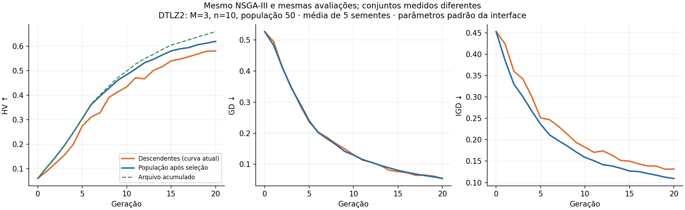

Análise do SimLab e comparação com NSGA-Studies, realizada em 09/09/2026.
Código examinado: SimLab `d4c639f`; NSGA-Studies `90201a3`, incluindo o notebook
local ainda não versionado `notebooks/evaluation/sch1-nsga-metrics.ipynb`.

**O diagnóstico é misto: há defeitos nos algoritmos e na integração, mas não
encontrei erro na fórmula central de HV ou no GD de média aritmética do SimLab.**
As curvas também misturam um conjunto diferente daquele medido nos notebooks,
referências distintas e parâmetros de busca diferentes. Portanto, a oscilação
isoladamente não identifica qual dessas causas está atuando.

Esta entrega contém investigação e reprodução numérica. As implementações da
aplicação não foram modificadas. Não foram consultados experimentos no MongoDB,
nem reproduzidos os containers de produção; os resultados abaixo são locais,
com chamadas ao código real e repositórios simulados em memória quando necessário.

**1. A curva por geração mede os descendentes, não a população preservada. Prioridade alta.**

O engine mantém `_parents` em memória e persiste `_current_population` na geração:
[nsga3.py](../../mo-engine/lib/strategy/nsga3.py), métodos `_generation_enqueue`
e `_evolution`; o NSGA-II segue o mesmo fluxo.
O endpoint [experiment.py](../../rest-api/api/endpoints/experiment.py), linhas
568–580 e 666–716, lê somente os indivíduos daquela geração. Assim, depois da
inicialização, `hv`, `gd`, `igd` e `igd_plus` são calculados sobre `ND(Q_t)`.
Os notebooks SCH1 retornam a frente dos sobreviventes `ND(P_t)`.

A seleção pode preservar um excelente pai que não reaparece entre os filhos.
O gráfico deixa esse pai de fora e aparenta regressão, mesmo que a busca ainda o
retenha. A opção `Cumulative` inclui um arquivo de todas as avaliações, que também
é diferente da população selecionada. Ela altera apenas o HV; GD/IGD continuam
sendo dos descendentes.

Reprodução: DTLZ2, M=3, n=10, população 50, 20 passos evolutivos, ruído zero,
sementes 1, 2, 3, 5 e 7, parâmetros padrão da interface. Usando os métodos reais
de reprodução e sobrevivência do NSGA-III, com exatamente as mesmas avaliações:

| Conjunto medido | HV final médio | Maior queda de HV em um passo | Maior aumento de GD em um passo |
| --- | ---: | ---: | ---: |
| Frente dos descendentes | 0,581202 | 0,042602 | 0,027124 |
| Frente dos sobreviventes | 0,620339 | 0,015225 | 0,001832 |



São médias de cinco sementes no gráfico; os máximos da tabela são tomados sobre
todos os passos e sementes. O ensaio aplica sobrevivência também ao último lote,
explicitamente diferente da finalização atual descrita no item 8.
Elitismo com população limitada não garante HV monotônico: NSGA-II/III truncam
a frente por diversidade, sem maximizar HV. GD tampouco precisa ser monotônico.
Com avaliações e referência fixas, o HV de um arquivo acumulado sem descarte
indevido deve ser não decrescente. Suavizar curvas não resolve a diferença de
conjuntos. A correção é persistir os sobreviventes de cada geração e identificar
claramente as séries de descendentes, sobreviventes e arquivo.

**2. O NSGA-III nativo não implementa a seleção canônica. Prioridade alta.**

Em [niching_selection.py](../../mo-engine/lib/nsga/niching_selection.py), linhas
123–175, há quatro diferenças materiais:

- Normalização pelo mínimo e amplitude apenas da frente que será truncada.
  Não há cálculo de extremos/interceptos nem consideração conjunta dos pontos
  das frentes já aceitas nesse estágio.
- Associação por distância euclidiana ao ponto no simplex, em vez da distância
  perpendicular à direção de referência.
- Contagem de ocupação começa em zero, ignorando os indivíduos já aceitos.
  O chamador nem passa esse conjunto à função.
- Nichos sem candidatos permanecem na busca por ocupação mínima. Quando eles
  monopolizam o mínimo, o código passa a escolher aleatoriamente entre todos os
  restantes, sem atualizar a ocupação desse fallback. Além disso, sempre escolhe
  o candidato mais próximo mesmo em nichos já ocupados.

A implementação de referência usa associação perpendicular, normalização por
extremos/interceptos com fallbacks, ocupação dos indivíduos já aceitos e remoção
de nichos sem candidatos. Ver o [código oficial da DEAP](https://github.com/DEAP/deap/blob/master/deap/tools/emo.py).
Existe `associate_to_niches` mais abaixo no arquivo local, mas ela não é usada
nessa seleção e, sozinha, não corrige os demais pontos.

O NSGA-III nativo do NSGA-Studies compartilha várias dessas simplificações.
Portanto, este defeito não explica sozinho a diferença entre os dois repositórios,
e o notebook nativo não deve ser tratado como implementação canônica.
No NSGA-II, ordenação e seleção por crowding examinadas são coerentes, mas o
torneio de reprodução desempata ranks aleatoriamente, sem crowding. É outra
diferença em relação ao torneio usual do NSGA-II.

**3. O SBX limitado tem um erro no segundo filho. Prioridade alta.**

[simulated_binary_crossover.py](../../mo-engine/lib/genetic_operators/crossover/simulated_binary_crossover.py),
linhas 34–47, calcula `beta/alpha/betaq` usando a distância ao limite inferior e
reutiliza esse mesmo valor para ambos os filhos. O segundo filho precisa de seu
próprio ajuste usando a distância ao limite superior. Fazer clipping depois
altera a distribuição, não substitui esse cálculo.

Caso reproduzido: pais 0,8 e 0,99; limites [0,1]; eta=20; sorteio 0,99.

| Implementação | Filho inferior | Filho superior |
| --- | ---: | ---: |
| SimLab | 0,780547064 | 1,000000000 |
| SBX limitado da DEAP | 0,780547064 | 0,999287945 |

O notebook SCH1 calcula os dois ajustes separadamente. Todos os adaptadores
SimLab que usam este operador, inclusive estratégias com sobrevivência DEAP ou
pymoo, herdam o problema. A evidência prova a distribuição incorreta; o impacto
total na convergência precisa ser medido depois da correção.

**4. Os parâmetros padrão não reproduzem os notebooks.**

Em [SyntheticLaunchWizard.vue](../../gui/simlab/src/components/synthetic-editor/launch/SyntheticLaunchWizard.vue),
linhas 143–153, `probMt=0.1` e `perGeneProb=0.05`. O engine testa a primeira
probabilidade antes de chamar a mutação; P0 testa a segunda para cada variável.
A chance efetiva de tentar mutar uma variável é **0,005 = 0,5%**.
Embora o adapter tenha fallback `1/n`, a interface sempre envia 0,05.

| Configuração | SimLab GUI | Notebook SCH1 local |
| --- | --- | --- |
| População / passos | 50 / 20 | 50 / 20 |
| Domínio SCH1 | [-5,5], mapeado de [0,1] | [-10,10] |
| Mutação por variável, n=1 | 0,5% | 100% |
| Divisões NSGA-III | 10: 11 direções em M=2 | 49: 50 direções |
| Conjunto medido | Descendentes | Sobreviventes |
| Filhos aproveitados por cruzamento | Dois | Apenas o primeiro |

Para DTLZ2, o draft padrão é M=3 e n=10. Já
`comparative/nsga-comparations4.ipynb` usa M=3 e n=2: não há variáveis de
distância, `g=0`, e a população nasce sobre a frente. O comparativo 5 usa M=6,
n=18 e referência de HV `[3]*M`, também diferente da GUI (`[1.1]*M`).

Uma ablação local alterando somente a mutação para `prob_mt=1`, `per_gene_prob=1/n`
não melhorou todos os resultados em 20 gerações. Médias dos cinco ensaios DTLZ2:

| Algoritmo | Configuração | HV dos sobreviventes | GD dos sobreviventes |
| --- | --- | ---: | ---: |
| NSGA-II | Padrão GUI | 0,533516 | 0,099148 |
| NSGA-II | Mutação 1/n | 0,559441 | 0,089897 |
| NSGA-III | Padrão GUI | 0,620339 | 0,054280 |
| NSGA-III | Mutação 1/n | 0,604930 | 0,078363 |

Logo, alinhar parâmetros é necessário para comparar, mas aumentar mutação não
está demonstrado como solução isolada. Este ensaio curto não é um ranking de
algoritmos nem uma análise de significância estatística.

**5. GD significa coisas diferentes nas duas medições, e a frente é muito esparsa em M alto.**

O [GD do SimLab](../../pylib/moo_metrics.py) usa `sum(d_i)/N`, normalizado pela
amplitude da referência. O notebook SCH1 usa `sqrt(sum(d_i²))/N`, em unidades
originais. Esta última expressão também não é RMS (`sqrt(sum(d_i²)/N)`).
Não são números diretamente comparáveis. O código instalado do pymoo 0.6.1.6
usa média das menores distâncias, como o SimLab sem normalização.

Executei as funções do notebook SCH1 com seus parâmetros, população inicial e
semente 42, e medi a **mesma frente final** com os dois caminhos:

| Frente | HV notebook | HV SimLab | GD notebook: p=2, cru, 1000 referências | GD SimLab: p=1, normalizado, 500 referências |
| --- | ---: | ---: | ---: | ---: |
| NSGA-II | 16,550983508 | 16,550983508 | 0,000683247 | 0,000917591 |
| NSGA-III | 16,573749287 | 16,573749287 | 0,000239366 | 0,000842041 |

O HV coincide. A diferença de GD aparece mesmo sem nenhuma mudança na solução.
Os resultados JSON também separam a mudança de fórmula, normalização e tamanho
da referência.

[benchmarks.true_front](../../pylib/benchmarks.py) usa apenas 500 pontos aleatórios
fixos para DTLZ2. Avaliei 200 pontos de outra amostra que estão exatamente sobre
a hiperesfera; sua distância radial real é aproximadamente zero:

| Objetivos | GD normalizado para a referência de 500 pontos |
| --- | ---: |
| 2 | 0,001603 |
| 3 | 0,029646 |
| 6 | 0,193786 |

Esse é erro de discretização da referência, não falta de convergência desses
pontos. A normalização também usa os extremos da amostra em lugar dos extremos
teóricos. A amostra tem seed fixa: ela não muda espontaneamente entre chamadas;
quem muda é a localização dos pontos da população em relação à amostra.
Para DTLZ2 sem ruído, a distância radial `||f||₂-1` é um diagnóstico analítico
útil. Para IGD/IGD+, é preciso um protocolo comum de amostragem suficientemente
densa; trocar pela distância radial não mede cobertura.

**6. Há divergência real entre os caminhos de HV e entre execuções.**

No sintético, a API usa `1.1*nadir_teórico`, como também faz
[plot_pareto_results.py](../../pareto-analysis/plot_pareto_results.py), linhas
839–846, quando recebe `--true-front-bench`. Porém,
[compute_hv_gd.py](../../pareto-analysis/compute_hv_gd.py), linhas 120–122,
continua usando `pior_observado + 5% + 1`, mesmo com essa opção. Seu comentário
de paridade com a API não corresponde a esse comportamento.

No modo real, a API deriva HV da pior observação de cada execução e GD da frente
final da própria execução. Isso impede comparar diretamente números de runs
diferentes. A referência de HV é fixa dentro do cálculo de uma execução pronta;
essa escolha não explica, sozinha, oscilações entre suas gerações.
A definição geométrica do HV depende do ponto de referência, como explica a
[documentação do pymoo](https://pymoo.org/misc/indicators.html).
É necessário unificar referências e devolver a definição completa na resposta.

**7. As sementes e a retomada não garantem reprodução. Prioridade alta quando esses caminhos são usados.**

[nsga3_deap.py](../../mo-engine/lib/strategy/nsga3_deap.py), linha 87, usa a
aleatoriedade NumPy da DEAP sem ligá-la ao `algorithm.random_seed`.
[nsga3_pymoo.py](../../mo-engine/lib/strategy/nsga3_pymoo.py), linhas 69–71,
chama `survival.do` sem `random_state`; o pymoo instalado cria um gerador sem seed
nesse caso. O `random.Random(seed)` do engine não controla esses geradores.

Com a mesma matriz de objetivos e cinco estratégias novas configuradas com
seed 42, houve um único conjunto selecionado no nativo e **cinco conjuntos
diferentes** em cada adaptador DEAP/pymoo. Trocar apenas `np.random.seed` também
não controla o `default_rng()` usado pelo pymoo nessa versão.

Na retomada, `_restore_population_state` carrega a geração anterior diretamente
como pais: [nsga2.py](../../mo-engine/lib/strategy/nsga2.py), linha 354, e
[nsga3.py](../../mo-engine/lib/strategy/nsga3.py), linha 360. Esses documentos
contêm os filhos anteriores, não os sobreviventes que poderiam vir de gerações
mais antigas. Em um checkpoint de população 10, a reprodução perdeu **4 pais
preservados em ambos os algoritmos**. O estado do RNG também não foi restaurado.
Isso pode causar saltos após reinício; não pressupõe que seus runs tenham sido
reiniciados. A correção exige salvar população selecionada e estados dos RNGs,
além do estado de normalização da biblioteca quando aplicável.

**8. A finalização pula a última seleção ambiental.**

O teste de parada em `_evolution` ocorre antes da seleção da última união.
`_final_pareto_front` devolve `ND(pais + últimos_filhos)`, não `ND(P_final)` após
a seleção para N indivíduos. Na reprodução com N=10 e configuração de duas
gerações, foram avaliados os índices 0,1,2, mas a sobrevivência só ocorreu no
índice 1. O NSGA-II terminou com 12 pontos na frente.

Contar a população inicial como geração 0 é uma convenção válida, mas é preciso
alinhar o orçamento de avaliações ao notebook. O problema independente dessa
convenção é comparar uma união de até 2N candidatos com a população selecionada
de N. A seleção final precisa ocorrer antes da coleta do resultado canônico.

**9. Defeitos adicionais confirmados no endpoint.**

O endpoint aceita nomes e ordem de objetivos, mas seleciona os primeiros
`n_obj` valores posicionais de cada indivíduo. A referência final, por outro
lado, é montada pelos nomes. Reordenar `[f1,f2]` para `[f2,f1]`, com a mesma
solução `(1,9)` usada como referência, mudou GD de **0 para 11,313708**.
É necessário mapear nomes para índices e validar a projeção; uma projeção de
DTLZ2 também não pode simplesmente usar a frente de um problema com menos M.
O fluxo normal da GUI manda a ordem cadastrada; esse defeito exige reordenação
ou seleção de subconjunto para se manifestar.

Quando todos os indivíduos são penalizados no modo real, `all_min` fica vazio e
`max()` lança `ValueError`. Além disso, uma execução sintética sem `pareto_front`
final retorna séries vazias antes de usar a referência analítica disponível.
Esses dois casos afetam disponibilidade das métricas, não provam flutuação em
séries já calculadas.

**Validação e arquivos reproduzíveis.**

- 201 testes passaram: `mo-engine/tests`, `pylib/tests/test_moo_metrics.py` e
  `pylib/tests/test_benchmarks.py`.
- 24 testes passaram: paridade de benchmarks/métricas e estatística em
  `pareto-analysis`.
- HV foi comparado com inclusão-exclusão exata de caixas em 2, 3 e 5 dimensões:
  erro máximo `5,55e-16`. GD contra cálculo direto e pymoo: `5,55e-17`.
  DTLZ2/ZDT1 contra pymoo: erro máximo `1,78e-15`.
- Os testes HTTP de `rest-api/tests/test_experiment.py` ficaram bloqueados na
  inicialização do `TestClient`/AnyIO neste ambiente e foram interrompidos.
  O endpoint foi exercitado diretamente com repos em memória pelo script abaixo.
- A suíte completa de `pareto-analysis` não foi coletada por ausência de
  `requests` na venv raiz; os 24 testes independentes dessa dependência passaram.
- Versões: NumPy 2.4.4, pymoo 0.6.1.6, DEAP 1.4.4, moocore 0.3.1.

Da raiz do SimLab:

```bash
MPLCONFIGDIR=/tmp/simlab-audit-mpl .venv/bin/python experiments/nsga-metrics-audit/run_audit.py --output /tmp/simlab-nsga-audit
rest-api/.venv/bin/python experiments/nsga-metrics-audit/run_api_audit.py
```

O primeiro script aceita `--studies /caminho/NSGA-Studies`. Ele usa funções do
notebook SCH1 sem executar as células de gráficos. O notebook é um arquivo local
não versionado; para reprodução em outra máquina é necessária a mesma versão.
O bloco de sementes de bibliotecas expõe justamente a não determinância atual;
as identidades escolhidas não são um resultado de referência fixo.

Resultados preservados: [dados numéricos](results/results.json),
[casos do endpoint](results/api-results.json) e
[gráfico em SVG](results/population-comparison.svg).

**Ordem de correção proposta:** primeiro definir/persistir a população medida e
alinhar o protocolo com o notebook; corrigir SBX e niching nativo; conectar os
RNGs e corrigir checkpoints/finalização; unificar referências, fórmula e
normalização de métricas entre API/CLI/notebooks. Depois, comparar múltiplas
sementes com os mesmos problemas, populações iniciais e orçamento de avaliações.
As opções `*_deap` e `*_pymoo` atuais substituem somente a sobrevivência: elas
não eliminam os defeitos compartilhados do pipeline.
