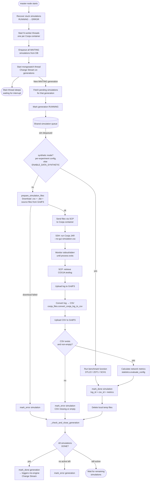
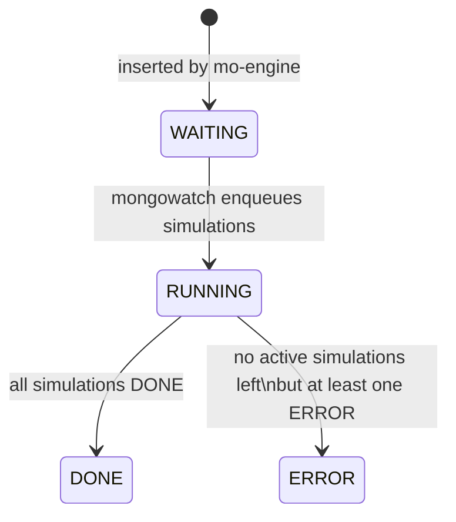

# master-node

The **master-node** is the simulation execution orchestrator in SimLab. It bridges MongoDB (where experiments and generations are defined) and a pool of [Cooja](https://github.com/contiki-ng/cooja) simulator containers, managing the full lifecycle of every simulation job: queuing, file transfer, execution, log collection, metric extraction, and status reporting.

---

## Architecture Overview

```
┌─────────────────────────────────────────────────────────────────┐
│                          master-node                            │
│                                                                 │
│  ┌──────────────┐    shared     ┌─────────────────────────────┐ │
│  │  mongowatch  │──────queue───▶│  simulation_worker (×N)     │ │
│  │  (thread)    │               │  - prepare files            │ │
│  └──────────────┘               │  - SSH/SCP transfer         │ │
│         ▲                       │  - run Cooja                │ │
│         │                       │  - collect logs & metrics   │ │
│  MongoDB Change                 └──────────────┬──────────────┘ │
│  Stream (WAITING                               │                │
│  generations)                                  │ mark done/error│
│                                                ▼                │
│                                  MongoDB (simulations,          │
│                                  generations, GridFS)           │
└─────────────────────────────────────────────────────────────────┘
```

---

## Startup Sequence

When `master-node.py` starts:

1. **Load settings** from environment variables.
2. **Recover stuck simulations** — any simulation left in `RUNNING` from a previous crash is marked `ERROR`, and its generation is re-evaluated.
3. **Start N worker threads** — one per Cooja container.
4. **Drain the pending queue** — all simulations already in `WAITING` state are enqueued immediately.
5. **Start the watcher thread** — listens to MongoDB Change Streams for new `WAITING` generations and enqueues their simulations in real time.
6. **Block** on the main thread (keyboard interrupt exits cleanly).

---

## Components

### `master-node.py`

The entry point. Holds the `Settings` dataclass, all core functions, and `main()`.

| Function | Responsibility |
|---|---|
| `Settings.from_env()` | Reads all configuration from environment variables |
| `recover_stuck_simulations()` | Marks crashed RUNNING simulations as ERROR on startup |
| `prepare_simulation_files()` | Downloads `.csc`, `.dat`, and source files from GridFS to a temp dir |
| `run_cooja_simulation()` | Executes Cooja via SSH, tails stdout/stderr, retrieves the log |
| `simulation_worker()` | Thread loop: dequeues a simulation, runs it (real or synthetic mode) |
| `start_workers()` | Spawns N worker threads, one per container |
| `load_initial_waiting_jobs()` | Enqueues all WAITING simulations present at startup |
| `_check_and_close_generation()` | After each simulation completes, checks if the whole generation is DONE or ERROR |
| `main()` | Orchestrates startup, watcher, and main loop |

### `lib/mongowatch.py`

Wraps the MongoDB Change Stream subscription for generations.

- Watches the `generations` collection for documents that transition to `WAITING`.
- For each event, fetches all pending simulations of that generation and puts them on the shared queue.
- Marks the generation as `RUNNING` once its simulations are enqueued.

### `lib/sshscp.py`

Thin wrappers around Paramiko and SCP:

- `create_ssh_client()` — opens an SSH connection to a Cooja container.
- `send_files_scp()` — transfers local files to the container's working directory.

### `lib/synthetic_data.py`

Fallback execution mode that replaces actual Cooja runs with benchmark functions
(**DTLZ2** — default, **ZDT1**, **SCH1**), useful for testing the pipeline
without launching the simulator.

> **Note — most synthetic experiments never reach this module.** Experiments
> encoded as `problem0` (the current GUI *Synthetic Instances* flow) are
> evaluated **in-process by the mo-engine** (analytical fast-path in
> `mo-engine/lib/strategy/analytical.py`): no `Simulation` documents are
> created, so the master-node stays idle. This module is only exercised by:
>
> 1. **`batch` strategy** experiments — `BatchStrategy` has no analytical
>    fast-path and always enqueues simulations;
> 2. **Legacy P1-encoded synthetic experiments** — benchmark variables encoded
>    as relay coordinates of a `problem1` instance;
> 3. **The global env-var override** (`ENABLE_DATA_SYNTHETIC=true`), which
>    turns any incoming simulation into a synthetic one.
>
> Keep this module in place while any of these paths is supported.

Two ways to enable it, with the per-experiment config taking precedence over the
environment variables:

- **Per-experiment** — `parameters.simulation.synthetic = { enabled, bench, noise_std }`,
  set through the GUI *Synthetic Instances* editor.
- **Global fallback** — `ENABLE_DATA_SYNTHETIC=true` (+ `BENCH`, `NOISE_STD`).

Both chromosome encodings are supported: the P0 decision vector is read verbatim
from `simulationElements.decisionVector`, while the legacy P1 genome (relay
coordinates, excluding the fixed sink) is normalized to `[0,1]ⁿ` via
`parameters.problem.region`. Objectives are written keyed by
`parameters.objectives[].metric_name`. See
[docs/markdown/SYNTHETIC_MODE.md](../docs/markdown/SYNTHETIC_MODE.md) for the full guide.

---

## Simulation Execution Flow



---

## Generation State Machine



---

## Configuration (Environment Variables)

| Variable | Default | Description |
|---|---|---|
| `MONGO_URI` | `mongodb://localhost:27017/?replicaSet=rs0` | MongoDB connection string (replica set required for Change Streams) |
| `DB_NAME` | `simlab` | Database name |
| `IS_DOCKER` | `false` | If `true`, hostnames are `cooja1..coojaΝ` on port 22; otherwise `localhost` on ports `2231+i` |
| `NUMBER_OF_CONTAINERS` | `3` | Number of Cooja containers (= number of worker threads) |
| `SIM_TIMEOUT_SEC` | `3600` | SSH command timeout and stuck-simulation cutoff in seconds. Set to `0` to disable recovery |
| `ENABLE_DATA_SYNTHETIC` | `false` | Replace Cooja execution with a benchmark function for experiments without a per-experiment `synthetic` block (only affects simulations that reach the master-node — P0 experiments are evaluated in-process by the mo-engine) |
| `BENCH` | `DTLZ2` | Benchmark to use in synthetic mode: `DTLZ2`, `ZDT1`, or `SCH1` |
| `NOISE_STD` | `0.0` | Standard deviation of Gaussian noise added to synthetic objectives |

---

## File Layout

```
master-node/
├── master-node.py          # Entry point and core orchestration logic
└── lib/
    ├── mongowatch.py       # MongoDB Change Stream watcher for generations
    ├── sshscp.py           # SSH/SCP helpers (Paramiko)
    └── synthetic_data.py   # Benchmark-based simulation replacement
```

---

## Dependencies

- **paramiko** + **scp** — SSH client and file transfer
- **pandas** — CSV parsing for log conversion
- **pymongo** + **bson** — MongoDB driver
- **pylib** (internal) — shared repositories, models, metrics, and Cooja file utilities

---

## Interaction with Other Services

| Service | How it interacts |
|---|---|
| **mo-engine** | Inserts `Generation` documents with status `WAITING`, which triggers the Change Stream watcher |
| **MongoDB** | Persistence for simulations, generations, and file storage (GridFS) |
| **Cooja containers** | Receives simulation files via SCP, runs Cooja, returns `COOJA.testlog` |
| **rest-api** | Reads simulation and generation status written by master-node; no direct communication |
