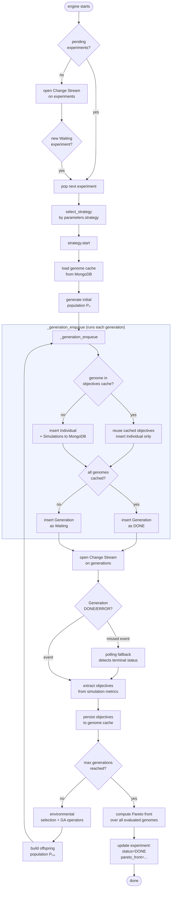

# mo-engine

The **mo-engine** is the multi-objective optimisation service of SimLab. It runs as an independent Docker container, watches MongoDB for new experiments, and drives the full evolutionary loop — from initial population generation to Pareto front extraction — without any polling-based coordination with other services.

---

## Table of Contents

- [Overview](#overview)
- [Architecture](#architecture)
- [Operation Flow](#operation-flow)
  - [Startup](#startup)
  - [Strategy Execution Flowchart](#strategy-execution-flowchart)
  - [Key Design Decisions](#key-design-decisions)
- [Components](#components)
- [Extending the Engine](#extending-the-engine)
  - [Adding a New Strategy](#adding-a-new-strategy)
  - [Adding a New Problem](#adding-a-new-problem)

---

## Overview

The mo-engine implements the **Strategy** design pattern. An *experiment* document in MongoDB carries a `parameters.strategy` field that selects which algorithm runs. The engine picks up experiments in `Waiting` status, instantiates the appropriate strategy, and calls `start()`. From that point on, the strategy manages its own lifecycle through MongoDB Change Streams.

The engine never directly communicates with the Cooja simulator. Instead, it writes simulation documents to MongoDB and waits for them to complete — the **master-node** handles all simulation scheduling and execution.

---

## Architecture

```
┌──────────────────────────────────────────────────────────┐
│                        mo-engine                         │
│                                                          │
│  engine.py                                               │
│  ├── watch experiments (Change Stream: status=Waiting)   │
│  └── select_strategy() → EngineStrategy.start()          │
│                                                          │
│  lib/strategy/nsga3.py  (NSGA3LoopStrategy)              │
│  ├── generates population (ProblemAdapter)               │
│  ├── writes Individuals + Simulations to MongoDB         │
│  ├── watches for Generation DONE (Change Stream)         │
│  └── extracts objectives → evolves → next generation     │
│                                                          │
│  lib/problem/                                            │
│  ├── adapter.py       (ProblemAdapter ABC)               │
│  ├── chromosomes.py   (Chromosome types)                 │
│  └── p1..p4_*.py      (problem-specific logic)           │
└──────────────────────────┬───────────────────────────────┘
                           │ reads / writes
                    ┌──────▼──────┐
                    │   MongoDB   │
                    │             │
                    │ experiments │
                    │ generations │
                    │ individuals │
                    │ simulations │
                    │ genome_cache│
                    └──────┬──────┘
                           │ Change Stream
                    ┌──────▼──────┐
                    │ master-node │  (schedules and runs
                    └─────────────┘   Cooja simulations)
```

---

## Operation Flow

### Startup

When the container starts, `engine.py`:

1. Queries MongoDB for experiments already in `Waiting` status (handles restarts).
2. Processes each pending experiment immediately.
3. Opens a Change Stream on the `experiments` collection to handle future experiments.

### Strategy Execution Flowchart



### Key Design Decisions

| Decision | Rationale |
|----------|-----------|
| **Change Streams instead of polling** | The engine reacts immediately when a generation finishes without holding a thread in a tight loop. |
| **Polling fallback** | If a Change Stream event is missed during a reconnection gap, a periodic poll (`BATCH_POLL_INTERVAL`) catches the terminal status. |
| **Genome cache (`genome_cache` collection)** | Objectives computed for a chromosome are persisted to MongoDB. If the same chromosome re-appears in a later generation, its objectives are reused immediately — no simulation is re-queued. This also survives mo-engine restarts. |
| **All-cached generation → DONE at insert** | When every genome in a generation has cached objectives, there is nothing for the master-node to execute. The generation document is inserted with `status=DONE` directly, so the Change Stream fires immediately and the algorithm advances. |
| **`_gen_index` incremented before generation insert** | The Change Stream callback runs on a separate thread. Incrementing the index before inserting avoids a race where the callback fires and reads a stale index. |
| **Worst-objective fallback for errors** | If a simulation fails, the chromosome receives `[+∞, …]` as objectives. This keeps the evolutionary loop running without deadlock, though it biases the front. Implement retry logic in `_handle_generation_done` if transient failures are common in your deployment. |

---

## Components

```
mo-engine/
├── engine.py                    # Entry point: watches experiments, dispatches strategies
│
├── lib/
│   ├── strategy/
│   │   ├── base.py              # EngineStrategy ABC (start, stop, event_*)
│   │   ├── nsga3.py             # NSGA-III implementation (the only strategy today)
│   │   └── simulation_seeds.py  # Seed utilities
│   │
│   ├── problem/
│   │   ├── adapter.py           # ProblemAdapter ABC
│   │   ├── chromosomes.py       # Chromosome types (P1–P4) + get_hash()
│   │   ├── resolve.py           # PROBLEM_REGISTRY + build_adapter()
│   │   ├── p1_continuous_mobility.py
│   │   ├── p2_discrete_mobility.py
│   │   ├── p3_target_coverage.py
│   │   └── p4_mobile_sink_collection.py
│   │
│   ├── nsga/                    # NSGA-III selection primitives
│   │   ├── fast_nondominated_sort.py
│   │   ├── niching_selection.py
│   │   └── crowding_distance.py
│   │
│   ├── genetic_operators/       # Crossover, mutation, selection implementations
│   │   ├── crossover/
│   │   ├── mutation/
│   │   └── selection/
│   │
│   └── util/                    # Network generation, connectivity helpers
│
└── tests/                       # Problem encoding tests (pytest)
```

---

## Extending the Engine

### Adding a New Strategy

A strategy encapsulates a complete optimisation algorithm. The contract is defined by `EngineStrategy` in [lib/strategy/base.py](lib/strategy/base.py).

**Step 1 — Implement the ABC:**

```python
# lib/strategy/my_strategy.py
from lib.strategy.base import EngineStrategy

class MyStrategy(EngineStrategy):

    def start(self):
        # Set up experiment state, generate initial solutions,
        # insert documents to MongoDB, open Change Streams.
        ...

    def stop(self):
        # Signal threads to exit.
        ...

    def event_simulation_done(self, sim_doc: dict):
        # Called for every simulation reaching DONE/ERROR.
        # Use for progress accounting only — do not drive flow here.
        ...

    def event_generation_done(self, gen_doc: dict):
        # Called when a generation reaches DONE/ERROR.
        # Drive the algorithm forward: extract objectives, evolve, enqueue next batch.
        ...
```

**Step 2 — Register the strategy in `engine.py`:**

```python
def select_strategy(exp_doc: dict) -> EngineStrategy:
    exp_type = exp_doc.get("parameters", {}).get("strategy", "simple")
    if exp_type == "nsga3":
        return NSGA3LoopStrategy(exp_doc, mongo)
    if exp_type == "my_strategy":          # ← add this
        return MyStrategy(exp_doc, mongo)
    raise ValueError(f"Unknown strategy: {exp_type}")
```

**Step 3 — Submit an experiment** with `parameters.strategy = "my_strategy"`.

> **Tip:** The `mongo` object (`MongoRepository`) gives you access to all repositories and the GridFS handler. You do not need to manage the MongoDB connection directly. See [pylib/db/factory.py](../pylib/db/factory.py) for the full list of available repositories.

---

### Adding a New Problem

A problem defines the chromosome representation, how to generate and evolve individuals, and how to encode a chromosome into a Cooja simulation configuration. The contract is `ProblemAdapter` in [lib/problem/adapter.py](lib/problem/adapter.py).

**Step 1 — Define the chromosome:**

```python
# lib/problem/chromosomes.py  (add at the bottom)
@dataclass(frozen=True, slots=True)
class ChromosomeP5(ChromosomeBase, Chromosome):
    mac_protocol: MacGene
    # ... your genes ...

    def to_dict(self) -> dict:
        return {"mac_protocol": self.mac_protocol, ...}

    def __eq__(self, other): ...
    def __hash__(self): ...
    # get_hash() is inherited from Chromosome (SHA-1 of to_dict())
    # Override only if your __eq__ is order-independent (see ChromosomeP1 for reference).
```

**Step 2 — Implement the adapter:**

```python
# lib/problem/p5_my_problem.py
from .adapter import ProblemAdapter, ChromosomeP5

class Problem5MyProblemAdapter(ProblemAdapter):

    def assert_problem(self, problem): ...          # validate the problem document

    def set_ga_operator_configs(self, rng, params): ... # configure GA hyperparameters

    def random_individual_generator(self, size): ...    # generate initial population

    def crossover(self, parents): ...                   # recombine two parents

    def mutate(self, chromosome): ...                   # perturb one individual

    def encode_simulation_input(self, ind) -> SimulationElements:
        # Translate the chromosome into the dict that master-node passes to Cooja.
        # Return {"fixedMotes": [...], "mobileMotes": [...]}.
        ...
```

**Step 3 — Register the problem:**

```python
# lib/problem/resolve.py
PROBLEM_REGISTRY: dict[str, Type[ProblemAdapter]] = {
    "problem1": Problem1ContinuousMobilityAdapter,
    ...
    "problem5": Problem5MyProblemAdapter,   # ← add this
}
```

**Step 4 — Reference the problem in the experiment JSON:**

```json
{
  "parameters": {
    "strategy": "nsga3",
    "problem": {
      "name": "problem5",
      ...
    }
  }
}
```

> See [lib/problem/README.md](lib/problem/README.md) for the mathematical definitions of the existing problems and their chromosome representations.
