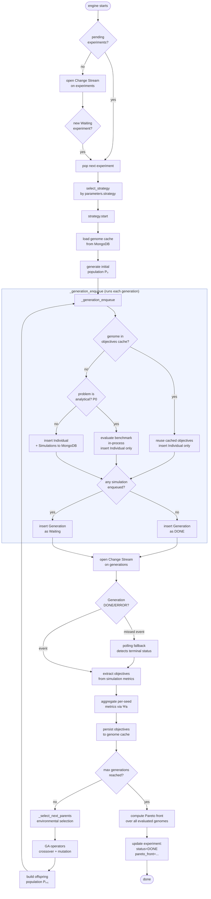

# mo-engine

The **mo-engine** is the multi-objective optimisation service of SimLab. It runs as an independent Docker container, watches MongoDB for new experiments, and drives the full evolutionary loop — from initial population generation to Pareto front extraction — without any polling-based coordination with other services.

---

## Table of Contents

- [Overview](#overview)
- [Architecture](#architecture)
- [Available Strategies](#available-strategies)
- [Operation Flow](#operation-flow)
  - [Startup](#startup)
  - [Strategy Execution Flowchart](#strategy-execution-flowchart)
  - [Key Design Decisions](#key-design-decisions)
- [Components](#components)
- [Extending the Engine](#extending-the-engine)
  - [Adding a New Strategy from Scratch](#adding-a-new-strategy-from-scratch)
  - [Adding a New NSGA-III Variant (selection-only override)](#adding-a-new-nsga-iii-variant-selection-only-override)
  - [Adding a New Problem](#adding-a-new-problem)
- [Configuration Reference](#configuration-reference)

---

## Overview

The mo-engine implements the **Strategy** design pattern. An *experiment* document in MongoDB carries a `parameters.strategy` field that selects which algorithm runs. The engine picks up experiments in `Waiting` status, instantiates the appropriate strategy, and calls `start()`. From that point on, the strategy manages its own lifecycle through MongoDB Change Streams.

The engine never directly communicates with the Cooja simulator. Instead, it writes simulation documents to MongoDB and waits for them to complete — the **master-node** handles all simulation scheduling and execution.

---

## Architecture

```
┌──────────────────────────────────────────────────────────────────────┐
│                             mo-engine                                │
│                                                                      │
│  engine.py                                                           │
│  ├── watch experiments (Change Stream: status=Waiting)               │
│  └── select_strategy() → EngineStrategy.start()                      │
│                                                                      │
│  lib/strategy/                                                       │
│  ├── base.py          EngineStrategy (ABC)                           │
│  ├── nsga3.py         NSGA3LoopStrategy  ──────┐  native NDS+niching │
│  ├── nsga3_deap.py    NSGA3DeapStrategy  ──────┤  DEAP selNSGA3      │
│  ├── nsga3_pymoo.py   NSGA3PymooStrategy ──────┘  pymoo survival     │
│  ├── nsga2.py         NSGA2LoopStrategy (+ deap/pymoo variants)      │
│  ├── batch.py         BatchStrategy                                  │
│  ├── random_search.py RandomSearchStrategy                           │
│  └── analytical.py    in-process evaluation of P0 benchmarks         │
│                                                                      │
│  lib/problem/                                                        │
│  ├── adapter.py       ProblemAdapter (ABC)                           │
│  ├── p0_synthetic.py  analytical benchmarks (evaluated in-process)   │
│  └── p1..p4_*.py      problem-specific logic (chromosome, GA ops)    │
└──────────────────────────────┬───────────────────────────────────────┘
                               │ reads / writes
                        ┌──────▼──────┐
                        │   MongoDB   │
                        │             │
                        │ experiments │
                        │ generations │
                        │ individuals │
                        │ simulations │
                        │ genome_cache│
                        └──────┬──────┘
                               │ Change Stream
                        ┌──────▼──────┐
                        │ master-node │  (schedules and runs
                        └─────────────┘   Cooja simulations)
```

---

## Available Strategies

| `parameters.strategy` | Class | Selection mechanism | Analytical fast-path (P0) | External deps |
|---|---|---|---|---|
| `nsga3` | `NSGA3LoopStrategy` | Native NDS + NSGA-III niching | ✅ | — |
| `nsga3_deap` | `NSGA3DeapStrategy` | DEAP `tools.selNSGA3` | ✅ (inherited) | `deap >= 1.3` |
| `nsga3_pymoo` | `NSGA3PymooStrategy` | pymoo `ReferenceDirectionSurvival` | ✅ (inherited) | `pymoo >= 0.6` |
| `nsga2` | `NSGA2LoopStrategy` | Native NDS + crowding distance | ✅ | — |
| `nsga2_deap` | `NSGA2DeapStrategy` | DEAP `tools.selNSGA2` | ✅ (inherited) | `deap >= 1.3` |
| `nsga2_pymoo` | `NSGA2PymooStrategy` | pymoo `RankAndCrowdingSurvival` | ✅ (inherited) | `pymoo >= 0.6` |
| `batch` | `BatchStrategy` | No evolution — evaluates one generation | ❌ (relies on master-node) | — |
| `random_search` | `RandomSearchStrategy` | Uniform random sampling, no crossover | ✅ | — |

The DEAP and pymoo variants share **all** SimLab infrastructure with their native base classes (Change Streams, Genome Cache, ProblemAdapter operators, resume capability) and differ only in the environmental-selection step. They are designed to reproduce **Table 3** of the companion article (HV / GD / IGD / Coverage comparison on DTLZ2).

### Analytical fast-path (P0 synthetic benchmarks)

For analytical problems (`problem0` — DTLZ2/ZDT1/SCH1 benchmarks) the objectives
are a closed-form function of the decision vector, so the strategies evaluate
them **in-process** via [lib/strategy/analytical.py](lib/strategy/analytical.py)
instead of enqueuing `Simulation` documents. This skips the MongoDB round-trip
and the master-node hop entirely: the generation completes through the
"no simulations pending → mark DONE" path.

`BatchStrategy` is the exception — it has no analytical fast-path and always
enqueues simulations, which the **master-node** then evaluates synthetically
(`master-node/lib/synthetic_data.py`). See
[docs/markdown/SYNTHETIC_MODE.md](../docs/markdown/SYNTHETIC_MODE.md) for the
full picture of the two evaluation paths.

### Aggregator parameter (`Ψa`)

All strategies support a `parameters.simulation.aggregator` field that controls how per-seed simulation metrics are collapsed into a single objective value per individual:

| Value | Behaviour |
|---|---|
| `"mean"` (default) | arithmetic mean — backward-compatible with all existing experiments |
| `"median"` | robust to outlier seeds |
| `"trimmed_mean"` | requires dict form: `{"kind": "trimmed_mean", "trim": 0.1}` |
| `"min"` / `"max"` | lower / upper bound across seeds |

```json
"simulation": {
    "duration": 180,
    "random_seeds": [336157, 667370],
    "aggregator": "median"
}
```

---

## Operation Flow

### Startup

When the container starts, `engine.py`:

1. Queries MongoDB for experiments already in `Waiting` status (handles restarts).
2. Processes each pending experiment immediately.
3. Opens a Change Stream on the `experiments` collection to handle future experiments.

### Strategy Execution Flowchart



### Key Design Decisions

| Decision | Rationale |
|----------|-----------|
| **Change Streams instead of polling** | The engine reacts immediately when a generation finishes without holding a thread in a tight loop. |
| **Polling fallback** | If a Change Stream event is missed during a reconnection gap, a periodic poll (`BATCH_POLL_INTERVAL`) catches the terminal status. |
| **Genome cache (`genome_cache` collection)** | Objectives computed for a chromosome are persisted to MongoDB. If the same chromosome re-appears in a later generation, its objectives are reused immediately — no simulation is re-queued. This also survives mo-engine restarts. |
| **Analytical fast-path for P0** | When `ProblemAdapter.is_analytical` is true (P0 synthetic benchmarks), objectives are computed in-process (`lib/strategy/analytical.py`) and no `Simulation` document is ever enqueued — the master-node is bypassed entirely. Only `BatchStrategy` lacks this path and still relies on the master-node's synthetic evaluator. |
| **All-cached generation → DONE at insert** | When every genome in a generation has cached objectives, there is nothing for the master-node to execute. The generation document is inserted with `status=DONE` directly, so the Change Stream fires immediately and the algorithm advances. |
| **`_gen_index` incremented before generation insert** | The Change Stream callback runs on a separate thread. Incrementing the index before inserting avoids a race where the callback fires and reads a stale index. |
| **Worst-objective fallback for errors** | If a simulation fails, the chromosome receives `[+∞, …]` as objectives. This keeps the evolutionary loop running without deadlock, though it biases the front. |
| **`_select_next_parents()` hook** | Environmental selection is isolated in a single overridable method. DEAP and pymoo variants inherit all infrastructure and override only this one method, minimising code duplication and regression surface. |

---

## Components

```
mo-engine/
├── engine.py                    # Entry point: watches experiments, dispatches strategies
│
├── lib/
│   ├── strategy/
│   │   ├── base.py              # EngineStrategy ABC (start, stop, event_*)
│   │   ├── nsga3.py             # NSGA-III (native NDS + niching)
│   │   ├── nsga3_deap.py        # NSGA-III via DEAP selNSGA3 (optional dep)
│   │   ├── nsga3_pymoo.py       # NSGA-III via pymoo ReferenceDirectionSurvival (optional dep)
│   │   ├── nsga2.py             # NSGA-II (crowding distance)
│   │   ├── nsga2_deap.py        # NSGA-II via DEAP selNSGA2 (optional dep)
│   │   ├── nsga2_pymoo.py       # NSGA-II via pymoo RankAndCrowdingSurvival (optional dep)
│   │   ├── batch.py             # Batch evaluation (no evolution)
│   │   ├── random_search.py     # Uniform random search (baseline strategy)
│   │   ├── analytical.py        # In-process evaluation of P0 benchmarks (no simulations)
│   │   └── simulation_seeds.py  # Seed utilities
│   │
│   ├── problem/
│   │   ├── adapter.py           # ProblemAdapter ABC (incl. is_analytical hook)
│   │   ├── chromosomes.py       # Chromosome types (P0–P4) + get_hash()
│   │   ├── resolve.py           # PROBLEM_REGISTRY + build_adapter()
│   │   ├── p0_synthetic.py      # P0: pure analytical benchmark (DTLZ2/ZDT1/SCH1)
│   │   ├── p1_continuous_mobility.py
│   │   ├── p2_discrete_mobility.py
│   │   ├── p3_target_coverage.py
│   │   └── p4_mobile_sink_collection.py
│   │
│   ├── nsga/                    # NSGA selection primitives
│   │   ├── fast_nondominated_sort.py
│   │   ├── niching_selection.py  # NSGA-III reference-point niching
│   │   └── crowding_distance.py  # NSGA-II crowding distance
│   │
│   ├── genetic_operators/       # Crossover, mutation, selection implementations
│   │   ├── crossover/
│   │   ├── mutation/
│   │   └── selection/
│   │
│   └── util/                    # Network generation, connectivity helpers
│
├── tests/                       # pytest suite (49 tests)
│   ├── test_aggregator_dispatch.py   # AGGREGATOR_DISPATCH and aggregate_seed_values
│   ├── test_nsga3_adapters.py        # DEAP / pymoo selection-hook smoke tests
│   ├── test_encode_p1..p4.py         # chromosome encode / decode
│   └── test_trajectory_coverage.py  # penalty and coverage scoring
│
└── requirements.txt             # pymongo, numpy, pandas, matplotlib, deap, pymoo
```

---

## Extending the Engine

### Adding a New Strategy from Scratch

A strategy encapsulates a complete optimisation algorithm. The contract is defined by `EngineStrategy` in [lib/strategy/base.py](lib/strategy/base.py).

**Step 1 — Implement the ABC:**

```python
# lib/strategy/my_strategy.py
from lib.strategy.base import EngineStrategy

class MyStrategy(EngineStrategy):

    def start(self):
        # Set up experiment state, generate initial solutions,
        # insert documents to MongoDB, open Change Streams.
        ...

    def stop(self):
        # Signal threads to exit.
        ...

    def event_simulation_done(self, sim_doc: dict):
        # Called for every simulation reaching DONE/ERROR.
        # Use for progress accounting only — do not drive flow here.
        ...

    def event_generation_done(self, gen_doc: dict):
        # Called when a generation reaches DONE/ERROR.
        # Drive the algorithm forward: extract objectives, evolve, enqueue next batch.
        ...
```

**Step 2 — Register the strategy in `engine.py`:**

```python
def select_strategy(exp_doc: dict) -> EngineStrategy:
    exp_type = exp_doc.get("parameters", {}).get("strategy", "simple")
    if exp_type == "nsga3":
        return NSGA3LoopStrategy(exp_doc, mongo)
    if exp_type == "my_strategy":          # ← add this
        return MyStrategy(exp_doc, mongo)
    raise ValueError(f"Unknown strategy: {exp_type}")
```

**Step 3 — Submit an experiment** with `parameters.strategy = "my_strategy"`.

> **Tip:** The `mongo` object (`MongoRepository`) gives you access to all repositories and the GridFS handler. You do not need to manage the MongoDB connection directly. See [pylib/db/factory.py](../pylib/db/factory.py) for the full list of available repositories.

---

### Adding a New NSGA-III Variant (selection-only override)

If you want to compare a different selection library while keeping the full SimLab infrastructure (Change Streams, Genome Cache, resume, ProblemAdapter operators), inherit from `NSGA3LoopStrategy` and override only `_select_next_parents()`.

```python
# lib/strategy/nsga3_mylib.py
from .nsga3 import NSGA3LoopStrategy

class NSGA3MyLibStrategy(NSGA3LoopStrategy):
    """NSGA-III with selection from my-library."""

    def __init__(self, experiment: dict, mongo) -> None:
        super().__init__(experiment, mongo)
        # Optional: import and initialise your library here.
        # All imports should be deferred so the module loads without the dep.
        ...

    def _select_next_parents(
        self,
        R_population: list,          # len = len(parents) + len(offspring)
        R_objectives: list[list[float]],  # same order, minimisation space
    ) -> list:
        """Return exactly self._pop_size chromosomes selected from R_population."""
        # Use R_objectives for selection; map result indices back to R_population.
        selected_indices = my_library.select(R_objectives, self._pop_size)
        return [R_population[i] for i in selected_indices]
        # Return None only if you call self._finalize_experiment() first.
```

Then register:

```python
if exp_type == "nsga3_mylib":
    return NSGA3MyLibStrategy(exp_doc, mongo)
```

Key invariants for the override:

- `R_population[i]` and `R_objectives[i]` correspond to the same individual.
- Objectives are already in **minimisation space** (max-objectives are sign-flipped).
- The method must return a list of **exactly `self._pop_size`** chromosomes drawn from `R_population`, OR return `None` after calling `self._finalize_experiment()`.
- `self._divisions` holds the reference-point granularity, `self._ga_rng` is the seeded `random.Random` instance for reproducibility.

---

### Adding a New Problem

A problem defines the chromosome representation, how to generate and evolve individuals, and how to encode a chromosome into a Cooja simulation configuration. The contract is `ProblemAdapter` in [lib/problem/adapter.py](lib/problem/adapter.py).

**Step 1 — Define the chromosome:**

```python
# lib/problem/chromosomes.py  (add at the bottom)
@dataclass(frozen=True, slots=True)
class ChromosomeP5(ChromosomeBase, Chromosome):
    mac_protocol: MacGene
    # ... your genes ...

    def to_dict(self) -> dict:
        return {"mac_protocol": self.mac_protocol, ...}

    def __eq__(self, other): ...
    def __hash__(self): ...
    # get_hash() is inherited from Chromosome (SHA-1 of to_dict())
```

**Step 2 — Implement the adapter:**

```python
# lib/problem/p5_my_problem.py
from .adapter import ProblemAdapter

class Problem5MyProblemAdapter(ProblemAdapter):

    def assert_problem(self, problem): ...
    def set_ga_operator_configs(self, rng, params): ...
    def random_individual_generator(self, size): ...
    def crossover(self, parents): ...
    def mutate(self, chromosome): ...
    def penalty_objectives(self, chromosome, n_obj): ...   # return None if feasible
    def encode_simulation_input(self, ind) -> SimulationElements: ...
```

**Step 3 — Register the problem:**

```python
# lib/problem/resolve.py
PROBLEM_REGISTRY: dict[str, Type[ProblemAdapter]] = {
    "problem1": Problem1ContinuousMobilityAdapter,
    ...
    "problem5": Problem5MyProblemAdapter,   # ← add this
}
```

**Step 4 — Reference the problem in the experiment JSON:**

```json
{
  "parameters": {
    "strategy": "nsga3",
    "problem": { "name": "problem5", ... }
  }
}
```

> See [lib/problem/README.md](lib/problem/README.md) for the mathematical definitions of the existing problems and their chromosome representations.

---

## Configuration Reference

Key environment variables consumed by the mo-engine container:

| Variable | Default | Description |
|---|---|---|
| `MONGO_URI` | `mongodb://localhost:27017/?replicaSet=rs0` | MongoDB connection string. Replica set is required for Change Streams. |
| `DB_NAME` | `simlab` | Database name. |
| `BATCH_POLL_INTERVAL` | `3600` | Seconds between polling-fallback scans for stuck generations. |

Key `parameters` fields in the experiment document:

| Field | Description |
|---|---|
| `parameters.strategy` | Strategy name (see [Available Strategies](#available-strategies)) |
| `parameters.objectives[].metric_name` | Metric key in `network_metrics` |
| `parameters.objectives[].goal` | `"min"` or `"max"` |
| `parameters.algorithm.population_size` | Population size (μ) |
| `parameters.algorithm.number_of_generations` | Max generations |
| `parameters.algorithm.random_seed` | GA RNG seed for reproducibility |
| `parameters.algorithm.divisions` | Reference-point granularity (NSGA-III) |
| `parameters.simulation.random_seeds` | Seeds for simulation runs per individual |
| `parameters.simulation.aggregator` | Seed aggregator (`"mean"`, `"median"`, `"trimmed_mean"`, `"min"`, `"max"`) |
