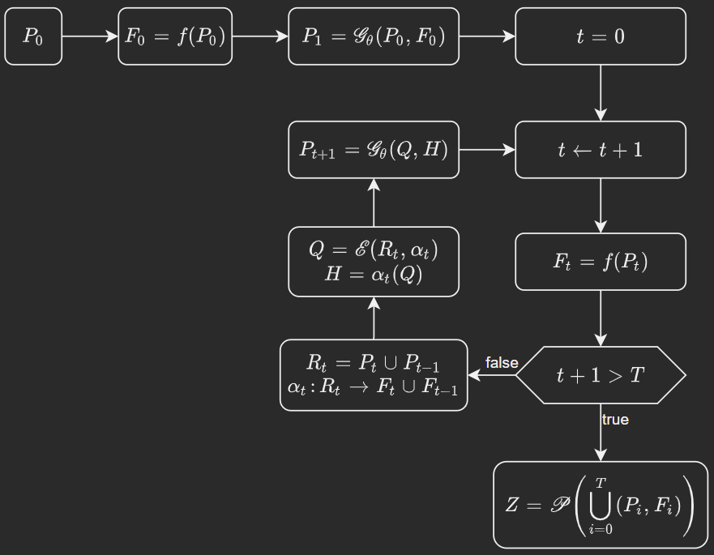

# Strategies

## NSGA-III

The diagram above illustrates the execution flow of the NSGA-III strategy adopted in this work.

Let us define the following elements:

- $N \in \mathbb{Z}_+$ denotes the population size.
- $X$ denotes the configuration (decision) space of the problem.
- $Y$ denotes the objective space.
- $\Theta$ is the parameter space associated with the genetic operators.
- The genetic operator is defined as
  $$
  \mathcal{G} : \Theta \times X^N \times Y^N \rightarrow X^N,
  $$
  and, for a fixed parameter vector $\theta \in \Theta$, we write
  $$
  \mathcal{G}_\theta : X^N \times Y^N \rightarrow X^N.
  $$
- $f : X \rightarrow Y$ is the evaluation (or simulation) function that maps a configuration $x \in X$ to its corresponding objective vector in $Y$.
- $t \in \mathbb{Z}_+$ denotes the generation index, and $T \in \mathbb{Z}_+$ is the maximum number of generations.
- For each generation $t$, $P_t \subset X$ denotes the population at generation $t$, and $F_t = f(P_t) \subset Y$ denotes the corresponding set of objective vectors.
- The intermediate population
  $$
  R_t = P_t \cup P_{t-1}
  $$
  aggregates the current and previous populations. This constitutes a slight abuse of notation. Strictly speaking, $P_t$ and $P_{t-1}$ denote populations, that is, finite collections of chromosomes, each of which corresponds to a point in the configuration space $X$. Therefore, $R_t$ should be understood as the union of the sets of decision vectors in $X$ induced by the individuals of $P_t$ and $P_{t-1}$, rather than a set-theoretic union of abstract population objects.
- $\alpha_t$ is an association map
  $$
  \alpha_t : R_t \rightarrow F_t \cup F_{t-1},
  $$
  which assigns each chromosome in $R_t$ to its corresponding objective vector.
- For a finite set $R \subset X$, we interpret
    $$
    \mathcal{E} : R \times R^Y \rightarrow X^N
    $$
    as a selection (or environmental filtering) operator. This operator selects a reduced subset
    $$
    Q = \mathcal{E}(R_t, \alpha_t),
    $$
    and simultaneously induces auxiliary structural information
    $$
    H = \alpha_t(Q),
    $$
    which is subsequently used by the genetic operator.
- The next population is generated as
  $$
  P_{t+1} = \mathcal{G}_\theta(Q, H).
  $$
- After completing $T$ generations, the final result is obtained by applying the Pareto extraction operator
  $$
  Z = \mathcal{P}\left(\bigcup_{i=0}^{T} (P_i, F_i)\right),
  $$
  where $\mathcal{P}$ computes the final Pareto front.

This formulation explicitly separates evaluation, selection, variation, and Pareto extraction, and matches the iterative flow depicted in the diagram.
