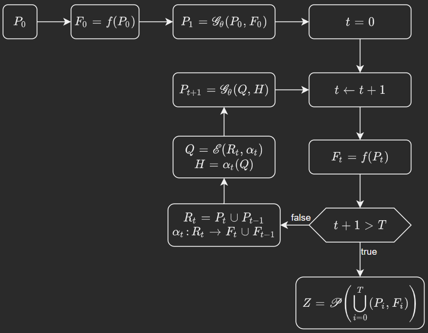

# Strategies

## NSGA-III

The diagram above illustrates the execution flow of the NSGA-III strategy adopted in this work.



Let us define the following elements:

- $N \in \mathbb{Z}_+$ denotes the population size.
- $X$ denotes the configuration (decision) space of the problem.
- $Y$ denotes the objective space.
- $\Theta$ is the parameter space associated with the genetic operators.
- The genetic operator is defined as
  $$
  \mathcal{G} : \Theta \times X^N \times Y^N \rightarrow X^N,
  $$
  and, for a fixed parameter vector $\theta \in \Theta$, we write
  $$
  \mathcal{G}_\theta : X^N \times Y^N \rightarrow X^N.
  $$
- $f : X \rightarrow Y$ is the evaluation (or simulation) function that maps a configuration $x \in X$ to its corresponding objective vector in $Y$.
- $t \in \mathbb{Z}_+$ denotes the generation index, and $T \in \mathbb{Z}_+$ is the maximum number of generations.
- For each generation $t$, $P_t \subset X$ denotes the population at generation $t$, and $F_t = f(P_t) \subset Y$ denotes the corresponding set of objective vectors.
- The intermediate population
  $$
  R_t = P_t \cup P_{t-1}
  $$
  aggregates the current and previous populations. This constitutes a slight abuse of notation. Strictly speaking, $P_t$ and $P_{t-1}$ denote populations, that is, finite collections of chromosomes, each of which corresponds to a point in the configuration space $X$. Therefore, $R_t$ should be understood as the union of the sets of decision vectors in $X$ induced by the individuals of $P_t$ and $P_{t-1}$, rather than a set-theoretic union of abstract population objects.
- $\alpha_t$ is an association map
  $$
  \alpha_t : R_t \rightarrow F_t \cup F_{t-1},
  $$
  which assigns each chromosome in $R_t$ to its corresponding objective vector.
- For a finite set $R \subset X$, we interpret
    $$
    \mathcal{E} : R \times R^Y \rightarrow X^N
    $$
    as a selection (or environmental filtering) operator. This operator selects a reduced subset
    $$
    Q = \mathcal{E}(R_t, \alpha_t),
    $$
    and simultaneously induces auxiliary structural information
    $$
    H = \alpha_t(Q),
    $$
    which is subsequently used by the genetic operator.
- The next population is generated as
  $$
  P_{t+1} = \mathcal{G}_\theta(Q, H).
  $$
- After completing $T$ generations, the final result is obtained by applying the Pareto extraction operator
  $$
  Z = \mathcal{P}\left(\bigcup_{i=0}^{T} (P_i, F_i)\right),
  $$
  where $\mathcal{P}$ computes the final Pareto front.

This formulation explicitly separates evaluation, selection, variation, and Pareto extraction, and matches the iterative flow depicted in the diagram.

## Batch

The `batch` strategy runs a fixed list of pre-defined chromosomes as a single
generation. It performs **no** reproduction, selection or variation: the input
chromosomes are inserted as individuals of `generation_0` and their simulations
are queued immediately. When every simulation reaches a terminal state the
strategy consolidates per-individual objectives, computes the (non-dominated)
Pareto front over the batch and finalises the experiment.

Input shape (subset relevant to this strategy):

```jsonc
{
  "parameters": {
    "strategy": "batch",
    "problem":   { "name": "problem2", ... },
    "simulation":{ "duration": 180, "random_seeds": [336157, 35239] },
    "objectives":[ { "metric_name": "latency", "goal": "min" }, ... ],
    "chromosomes": [
      { "mac_protocol": 0, "mask": [1,0,1,...] },
      { "mac_protocol": 1, "mask": [0,1,1,...] }
    ]
  }
}
```

Use cases: reproducible benchmarks, validating a specific Pareto set found by
another strategy, or executing a user-curated candidate list without any
evolutionary search.

> Note: `batch` is the only strategy **without** the analytical fast-path
> described below — synthetic batch experiments are evaluated by the
> master-node (`master-node/lib/synthetic_data.py`), not in-process.

## Analytical fast-path (`analytical.py`)

For analytical problems (P0 synthetic benchmarks — DTLZ2/ZDT1/SCH1) the
objectives are a closed-form function of the decision vector, so the evaluation
map $f : X \rightarrow Y$ is computed **directly in the mo-engine process**
instead of being delegated to simulation:

- During `_generation_enqueue`, when `ProblemAdapter.is_analytical` is `True`,
  the strategy calls `analytical_objectives()` and inserts the `Individual`
  with its objectives already filled — **no `Simulation` document is created**
  and the master-node is never involved.
- The benchmark is evaluated once per simulation seed and averaged (mean),
  mirroring the multi-seed aggregation used for simulation-based problems.
- Observation noise is reproducible: the RNG is seeded per
  `(seed, genome_hash)` pair, so re-evaluations and genome-cache hits are
  always consistent.

Supported by `nsga2`, `nsga3`, `random_search` and, by inheritance, all
DEAP/pymoo variants. See
[docs/markdown/SYNTHETIC_MODE.md](../../../docs/markdown/SYNTHETIC_MODE.md)
for the complete guide to synthetic mode.
